# Guía: portal de chispas de Dr. Strange en Houdini

Paso a paso para construir el portal del *sling ring* de Doctor Strange: un anillo de chispas que nace pequeño, crece, se deforma con un mapa de ruido y lanza chispas naranjas en forma de rayas que rebotan en el piso. Lleva un humo leve en el aro, se renderiza con Karma XPU y el glow se agrega en Copernicus.

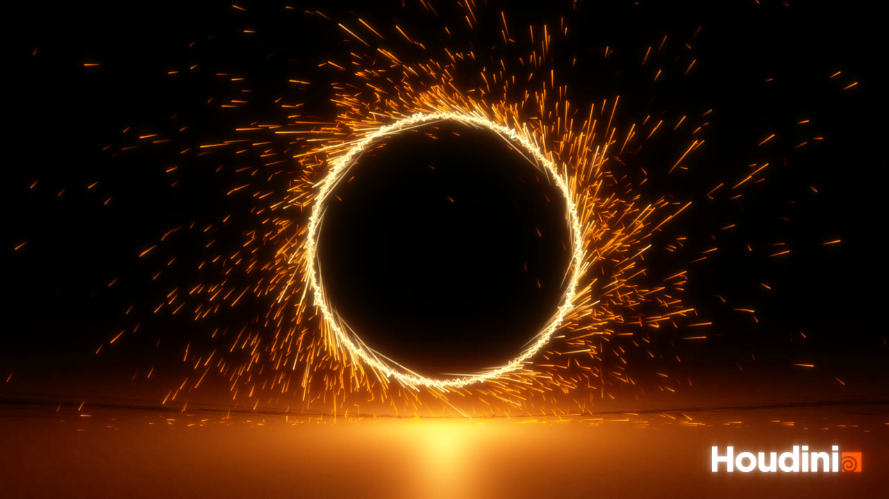

▶ [Ver el video del render](img/karma.mp4)
*El resultado: frames 1–240 (10 s a 24 fps), Karma XPU a 1024 × 1024 con humo, compuesto en Copernicus (glow, curva fílmica y saturación). Aquí reducido a 720 × 720.*

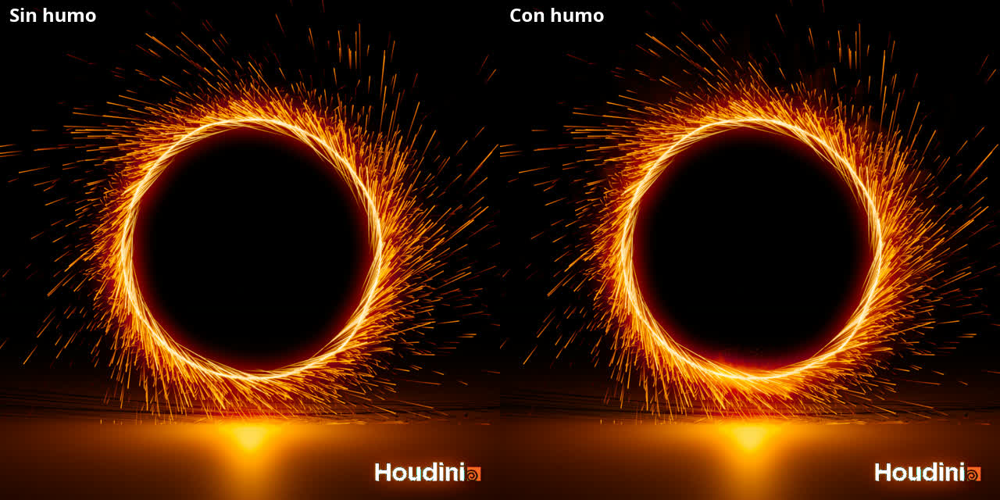
*Frame 73: sin humo y con humo leve, ya compuestos.*

> [!NOTE]
> **Versión web**
> Pública, para compartir con la clase: <https://venttisca.github.io/Guias/portal-dr-strange-houdini/> (con el video del render, capturas ampliables, código para copiar y casillas por paso). El texto también está en el repo público [Venttisca/Guias](https://github.com/Venttisca/Guias).

> [!TIP]
> **Versión web:** esta guía también está como página, con capturas ampliables, botones para copiar el código y casillas para marcar cada paso: <https://venttisca.github.io/Guias/portal-dr-strange-houdini/>

> [!NOTE]
> **En resumen**
> 1. Un **círculo** crece y se abre. Un **mapa de ruido 3D** deforma su borde para que no sea un círculo perfecto.
> 2. Cada punto del círculo recibe una **velocidad tangencial**, que barre el borde y sale hacia afuera.
> 3. Un **POP Network** suelta chispas desde ese círculo y las hace girar. También las frena y les aplica gravedad. Una **fuerza Metaball** mantiene limpio el hueco del centro y un **Ground Plane** las hace rebotar.
> 4. Después de simular, cada chispa se convierte en una **línea** orientada por su velocidad. Con puntos parecería un fuego artificial.
> 5. **Look:** chispas y anillo con material **emisivo** (MaterialX), una luz naranja para el piso y render en **Karma XPU**.
> 6. **Humo (opcional):** un **Pyro Solver** suelta humo leve desde el aro, que brilla naranja por sí mismo. Se prende y apaga con un interruptor.
> 7. **Composición:** en **Copernicus** (dentro de Houdini) se agregan dos glows, una curva fílmica y saturación, y se guarda la secuencia final.
>
> Tiempo aproximado: 60–90 min la primera vez, más ~30 min el humo y la composición. La simulación de chispas tarda segundos; la del humo, unos minutos. El render en Karma XPU (RTX 4060 + Ryzen 5 5600G) tarda ~10 s por frame sin humo (~43 min los 10 s) y ~18 s por frame con humo (de ~9 s al inicio a ~22 s al final, conforme crecen el humo y las chispas): ~75 min los 10 s. La composición tarda segundos.

> [!WARNING]
> **Regla de trabajo: no renderizar hasta que el movimiento esté bien**
> Revisa la simulación con previews de **OpenGL** (paso 8) y pasa a Karma solo cuando el movimiento te convenza. Un render largo de algo que todavía está mal es tiempo perdido.

## Antes de empezar
- **Versión:** Houdini 22.0 Apprentice. Algunos nodos se llaman `::2.0` (POP Source, POP Solver, Attribute Noise); el menú Tab elige la versión nueva solo.
- **Unidades:** 1 unidad = 1 metro. El portal mide **2 m de radio** y está de pie en el plano **XY**, mirando hacia +Z, que es donde está la cámara.
- **Animación:** 24 fps, frames **1 a 240** (10 s). Se configura en *Global Animation Options*, el reloj abajo a la derecha.
- **Cómo crear nodos:** dentro de una red, pulsa **Tab** y escribe el nombre del nodo. Para entrar a un nodo, doble clic (o **I**); para salir, **U**.
- **Renombra cada nodo** con el nombre de la guía. Varias expresiones apuntan a los nodos por nombre (por ejemplo `ch("../anillo_emisor/radx")`).
- **Flags:** el **display flag** (azul) dice qué se ve en el viewport y el **render flag** (morado) qué se renderiza. En `/obj`, el display flag de un objeto también decide **si Karma lo ve**.

> [!TIP]
> **Los códigos VEX y sus sliders**
> Los códigos usan `chf("nombre")` para que los valores sean **sliders**. Después de pegar el código en un Wrangle, pulsa el botón **Create spare parameters** (el cuadrito con un `+` a la derecha del cuadro de código). Aparecen los sliders en 0; luego escribe los valores de la tabla.

> [!TIP]
> **Expresiones**
> Algunos parámetros llevan una **expresión** en vez de un número (por ejemplo `-$F * 4`). Escríbela tal cual en el campo; el campo se pone verde. `$F` es el frame actual y `$T` el tiempo en segundos.

## Mapa de lo que vas a construir
Dentro de `/obj/portal` (nivel SOP):
```
anillo_emisor (Circle)
  → normal_radial (Wrangle) → mapa_de_ruido (Attribute Noise) → desplazar_por_ruido (Wrangle) → OUT_anillo (Null)
  → velocidad_tangencial (Wrangle) → OUT_emisor (Null)          ┄┄ lo lee fuente_anillo
hueco_metaball (Metaball)                                        ┄┄ lo lee la fuerza "hueco"
chispas_sim (DOP Network)
  ┄ importar_chispas (DOP Import) → color_por_edad (Wrangle) → estelas_lineas (Wrangle)
        ├→ OUT_chispas (Null, display flag: preview)
        └→ look_render (Wrangle) → RENDER_chispas (Null, render flag: Karma)
```
Dentro de `chispas_sim` (nivel DOP):
```
chispas (POP Object) ───────────────────────────────────────────────→ popsolver [entrada 1: Object]
fuente_anillo → vida_aleatoria → giro_portal → hueco → frenado → gravedad_y_ruido → popsolver [entrada 3]

piso (Ground Plane) ─┐ (izquierda)
popsolver ───────────┴→ colisiones (Merge) → output
```
En `/obj`: `portal`, `anillo_brillante` (copia el anillo deformado para la línea brillante), `piso`, `luz_portal`, `cam_preview` y, si llevas humo, `CONTROLES` y `humo`. En `/mat`, tres materiales (cuatro con el humo); en `/out`, un ROP de OpenGL y uno de Karma.

Dentro de `/obj/humo` (paso 12, opcional):
```
traer_anillo (Object Merge) → fuente_humo (Wrangle) → rasterizar_fuente (Volume Rasterize Attributes)
  → sim_humo (Pyro Solver) → densidad_y_temperatura (Blast) → cache_humo (File Cache)
  → material_humo (Material) → OUT_humo (Null)
```
Dentro de `/img/comp_portal` (paso 13, Copernicus):
```
render_karma (File) → glow_cerca (Glow) → glow_lejos (Glow) → curva_filmica (Tonemap) → saturacion (HSV) → OUT_comp (Output)
guardar_comp (ROP Image) ┄┄ lee saturacion
```

Las flechas punteadas (┄) no son cables: el nodo lee la geometría por su **SOP Path**.

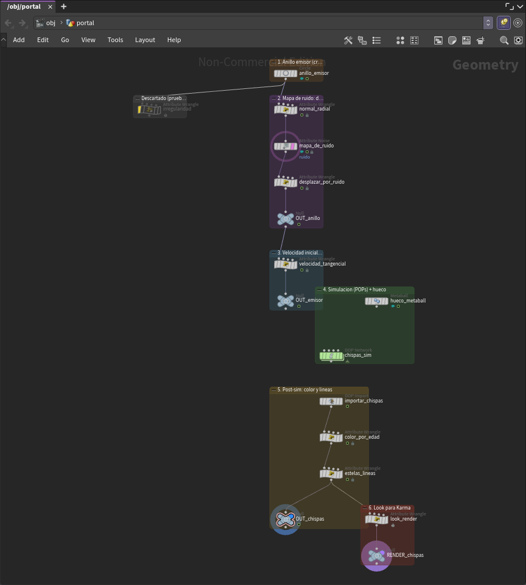
*La red dentro de `/obj/portal`, ordenada en cajas por etapa: 1. anillo, 2. mapa de ruido, 3. velocidad, 4. simulación, 5. color y líneas, 6. look para Karma. `irregularidad` (gris, arriba a la izquierda) es una prueba descartada que **no** se conecta; no hace falta crearla.*

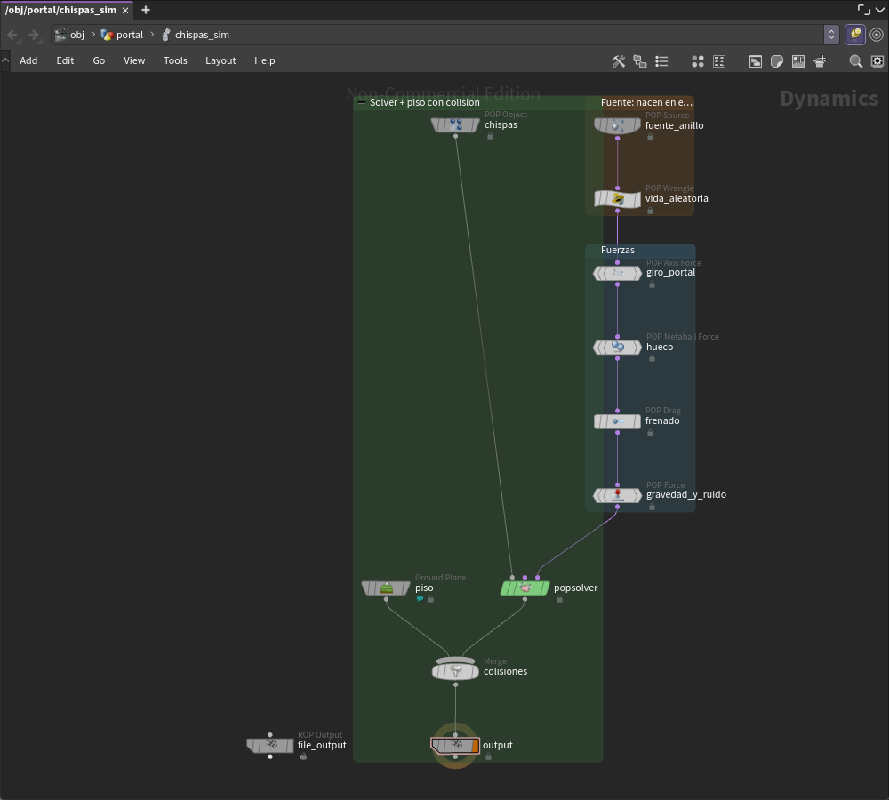
*La red dentro de `chispas_sim`. La fuente y las fuerzas van en cadena a la **3ª entrada** del `popsolver`. El `piso` entra a la **izquierda** del merge `colisiones`.*

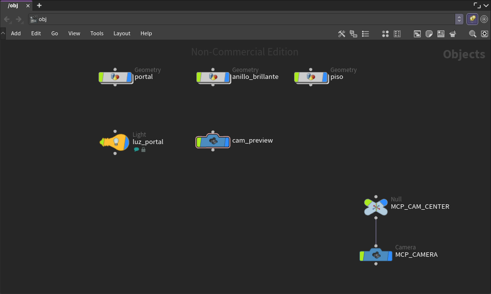
*El nivel `/obj` terminado. `MCP_CAM_CENTER` y `MCP_CAMERA` los creó la herramienta de previews de Claude; no hacen falta.*

---

## Paso 1: el objeto contenedor
1. En `/obj`, **Tab → Geometry**. Llámalo `portal`.
2. Entra (doble clic). Los pasos 2 a 7 van adentro.

## Paso 2: el anillo emisor
El círculo del que nacen las chispas. **Crece** de 0.24 m a 2 m en 2.5 s, arrancando rápido y frenando al final (*ease-out*). También **se abre** como un arco y **gira**.

| Nodo | Nombre | Parámetros |
|---|---|---|
| Circle | `anillo_emisor` | Primitive Type **Polygon**, Orientation **XY Plane**, Divisions **360**, Arc Type **Open Arc** |

Expresiones (escríbelas en el campo):
| Parámetro | Expresión | Qué hace |
|---|---|---|
| Radius (X) | `2 * (0.12 + 0.88 * (1 - pow(1 - clamp(($F - 1) / 60, 0, 1), 3)))` | Crece hasta 2 m en el frame 61 (curva cúbica *ease-out*) |
| Radius (Y) | `ch("radx")` | Igual que X |
| Arc Angles (2º campo) | `fit($F, 1, 36, 1, 360)` | El arco se abre de 0° a 360° en 1.5 s |
| Rotate (Z) | `-$F * 4` | El anillo gira 4° por frame |

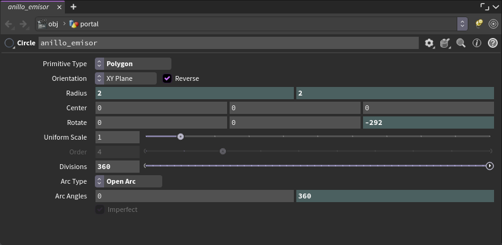
*`anillo_emisor` en el frame 73. Los campos verdes tienen expresión; se ve su valor en ese frame (radio 2, arco 360°). *Reverse* se marca solo.*

## Paso 3: el mapa de ruido (que no sea un círculo perfecto)
El anillo atraviesa un **campo de ruido 3D animado** que empuja cada punto hacia afuera o hacia adentro. Así el portal parece que "lucha" por mantenerse circular.

1. Debajo de `anillo_emisor`, **Tab → Attribute Wrangle**, nombre `normal_radial` (Run Over: *Points*):
```vex
// Normal hacia afuera del portal: el ruido empuja el borde hacia afuera o hacia adentro
v@N = normalize(set(@P.x, @P.y, 0));
```
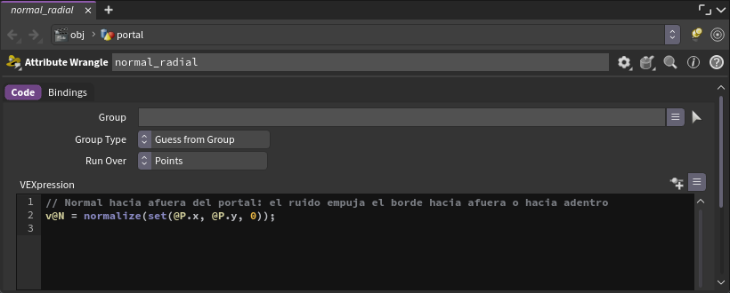

2. Debajo, **Tab → Attribute Noise**, nombre `mapa_de_ruido`:

| Sección | Parámetro | Valor |
|---|---|---|
| General | Attribute Names | **Float**, `ruido` |
| Noise Value | Range Values | **Zero Centered** |
| | Amplitude | **0.38** (m de deformación) |
| Noise Pattern | Noise Type | **Simplex** |
| | Element Size | **6.68** (tamaño de las manchas) |
| | Offset (pulsa **xyz** para verlo por eje) | X `$T * 0.7`, Y `$T * -0.5`, Z 0: el mapa viaja |
| Animation | Animated | ✔, Pulse Duration **1.5** (qué tan rápido cambia) |
| Fractal | Type | **Standard (fBm)**, Max Octaves **3**, Roughness **0.45** |

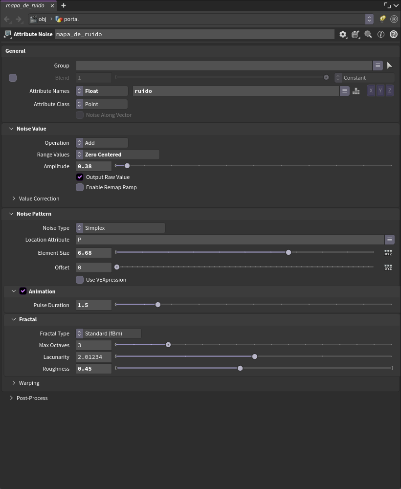
*`mapa_de_ruido` con *Animation* y *Fractal* abiertos.*

3. Debajo, **Tab → Attribute Wrangle**, nombre `desplazar_por_ruido`:
```vex
// Empuja el borde por la normal radial segun el valor del mapa de ruido (en metros).
// Se escala con el radio: un portal pequeno se deforma proporcionalmente igual.
float escala = chf("../anillo_emisor/radx") / 2.0;
@P += v@N * f@ruido * escala;
```
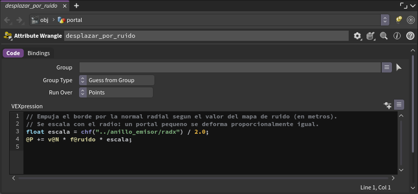

> [!NOTE]
> **¿Por qué un wrangle y no "Noise Along Vector"?**
> El Attribute Noise tiene una opción para desplazar a lo largo de un vector, pero con un atributo *Float* no movió los puntos. El wrangle hace lo mismo y además escala la deformación con el radio, así que el portal pequeño no se deforma de más.

4. Debajo, **Tab → Null**, nombre `OUT_anillo`. Es la salida del anillo deformado; la usan las chispas y la línea brillante.

## Paso 4: la velocidad inicial de las chispas
Cada punto del anillo guarda una velocidad `v`. La **POP Source** la hereda y así las chispas nacen ya en movimiento: barren el borde (dirección tangente) y salen hacia afuera.

Debajo de `OUT_anillo`, **Tab → Attribute Wrangle**, nombre `velocidad_tangencial`:
```vex
// Velocidad inicial de cada chispa: barre el borde del portal y sale hacia afuera
vector eje = {0, 0, 1};                 // normal del portal
vector r   = normalize(set(@P.x, @P.y, 0));
float giro   = chf("vel_giro");         // a lo largo del borde
float salida = chf("vel_salida");       // hacia afuera

// Aleatoriedad por chispa: la mayoria normales, pocas muy rapidas (cola larga).
// Asi el borde exterior no termina en un anillo parejo.
float sem = @ptnum * 13.7 + @Frame * 7.1;
float k = fit01(pow(rand(sem), chf("sesgo")), chf("vel_min"), chf("vel_max"));
// Rafagas: el ruido a lo largo del anillo hace zonas con mas y menos fuerza
float rafaga = fit(noise(set(@ptnum * 0.05, @Frame * 0.15, 0)), 0.3, 0.7, 0.6, 1.4);

v@v = (cross(eje, r) * giro + r * salida) * k * rafaga;
v@v += (rand(sem + 1) - 0.5) * chf("variacion");

// Portal pequeno = chispas lentas: la velocidad crece con el radio (1 a 2 m)
float escala_radio = chf("../anillo_emisor/radx") / 2.0;
v@v *= escala_radio;
```
Pulsa **Create spare parameters** y pon:

| Slider | Valor | Qué controla |
|---|---|---|
| vel_giro | **9** | Velocidad a lo largo del borde (m/s) |
| vel_salida | **3.5** | Velocidad hacia afuera (m/s) |
| variacion | **2** | Ruido aleatorio en la dirección |
| sesgo | **3** | Más alto = menos chispas rápidas (la "cola larga") |
| vel_min / vel_max | **0.6 / 2.2** | Rango del multiplicador por chispa |

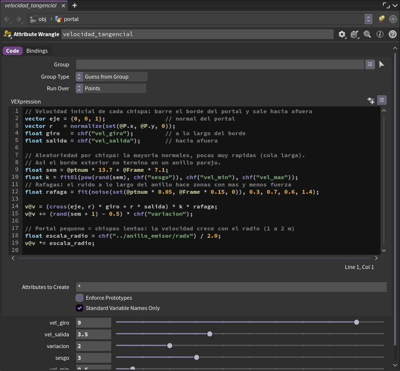

Debajo, **Tab → Null**, nombre `OUT_emisor`.

## Paso 5: el hueco del centro
Una **metaball** del tamaño del hueco. No se ve; solo la usa la fuerza `hueco` (paso 6) para empujar hacia afuera las chispas que se acercan al centro. Es el truco que usó RISE FX en la película.

| Nodo | Nombre | Parámetros |
|---|---|---|
| Metaball | `hueco_metaball` | Radius X, Y y Z: `ch("../anillo_emisor/radx") * 0.9` (crece con el portal). No se conecta a nada |

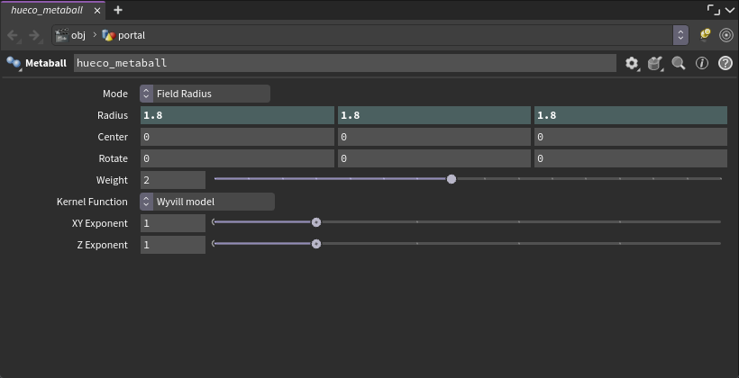

## Paso 6: la simulación de chispas
1. **Tab → DOP Network**, nombre `chispas_sim`. Entra en él (puede traer un nodo `output`; déjalo).
2. Crea estos nodos:

| Nodo | Nombre | Parámetros |
|---|---|---|
| POP Object | `chispas` | Pestaña **Physical**: Bounce **0.35**, Friction **0.5**, Dynamic Friction Scale **0.5** |
| POP Source | `fuente_anillo` | **Source:** Emission Type **Points**, SOP `../../OUT_emisor`. **Birth:** Const. Activation 1, Const. Birth Rate **10 000**, Life Expectancy **0.5**, Life Variance **0.25**. **Attributes:** Initial Velocity **Use inherited velocity**, Inherit Velocity **1** |
| POP Wrangle | `vida_aleatoria` | Código abajo |
| POP Axis Force | `giro_portal` | Shape **Sphere**, Center (0, 0, 0), Axis (0, 0, **1**), Radius `ch("../../anillo_emisor/radx") * 1.3`. Pestaña **Speed:** Orbit Speed `1.5 * ch("../../anillo_emisor/radx") / 2`, Lift 0, Suction 0 |
| POP Metaball Force | `hueco` | Geometry Source **SOP**, SOP Path `../../hueco_metaball`, Force Scale **30** |
| POP Drag | `frenado` | Air Resistance **0.3** |
| POP Force | `gravedad_y_ruido` | Force (0, **-2**, 0). Pestaña **Noise:** Amplitude **1.5**, Swirl Size **0.5** |
| POP Solver | `popsolver` | Por defecto |
| Ground Plane | `piso` | Center Y **-2.6**. Pestaña **Physical:** Bounce **0.35**, Friction **0.5**, Dynamic Friction Scale **0.5** |
| Merge | `colisiones` | Por defecto (relación *Collide*) |

Código de `vida_aleatoria`:
```vex
// Una sola vez por chispa: vida con cola larga para que no mueran todas a la misma distancia
if (i@vida_ok == 0) {
    float u = rand(i@id * 3.17 + 0.5);
    f@life *= fit01(pow(u, 2.5), 0.6, 1.5);
    f@brillo = fit01(rand(i@id * 1.91), 0.55, 1.25);
    i@vida_ok = 1;
}
```

3. **Conexiones:**
   - `fuente_anillo` → `vida_aleatoria` → `giro_portal` → `hueco` → `frenado` → `gravedad_y_ruido` → **3ª entrada** del `popsolver`.
   - `chispas` → **1ª entrada** del `popsolver`.
   - `piso` → **1ª entrada** (izquierda) de `colisiones`; `popsolver` → **2ª entrada**.
   - `colisiones` → `output`. Pon el **display flag** en `output`.

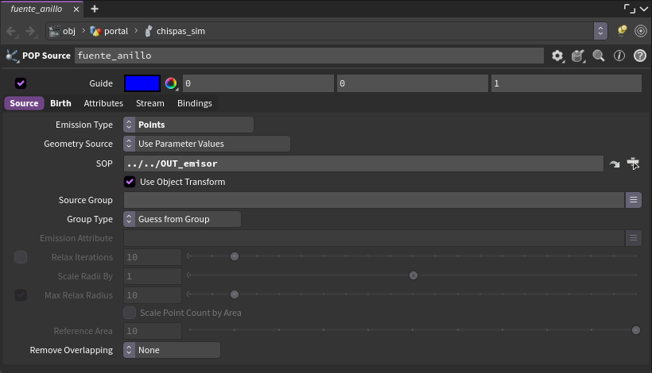
*`fuente_anillo`, pestaña Source: emite desde los puntos de `OUT_emisor`.*

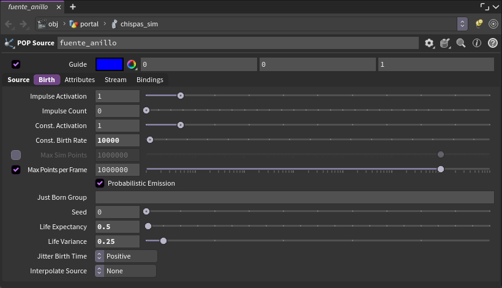
*Pestaña Birth: 10 000 chispas por segundo y vida corta (0.5 ± 0.25 s), para que las chispas de arriba no alcancen a frenarse y caer.*

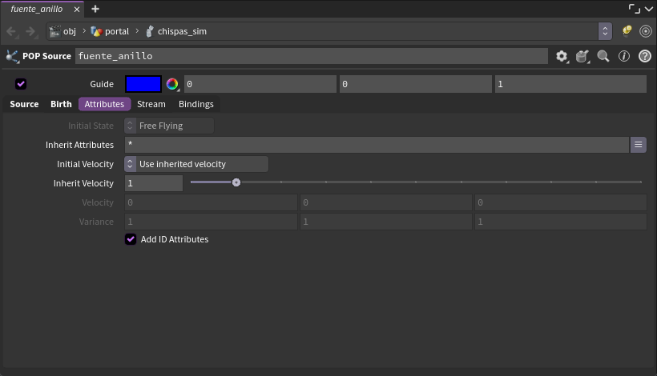
*Pestaña Attributes: **Use inherited velocity**. Sin esto, la velocidad del paso 4 no sirve de nada.*

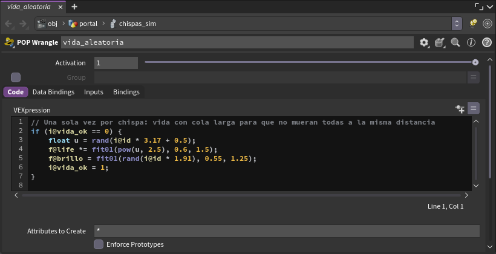
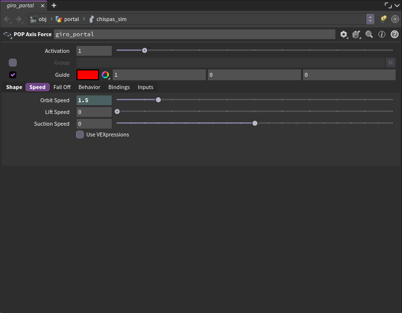
*`giro_portal`: el eje es Z porque el portal está de pie mirando a la cámara.*

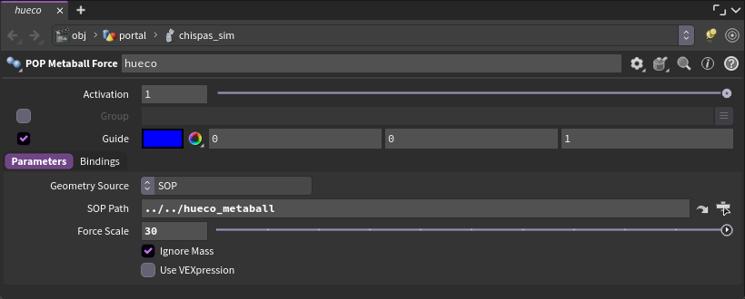
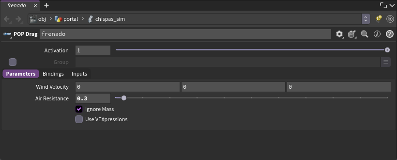
*Drag bajo (0.3). Con mucho drag las chispas se frenan y, en el paso 7, sus líneas se encogen a puntos.*

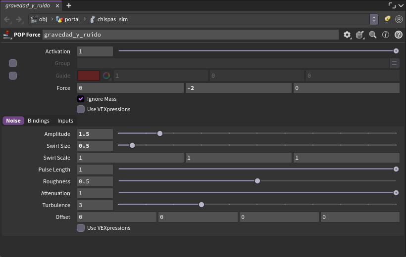
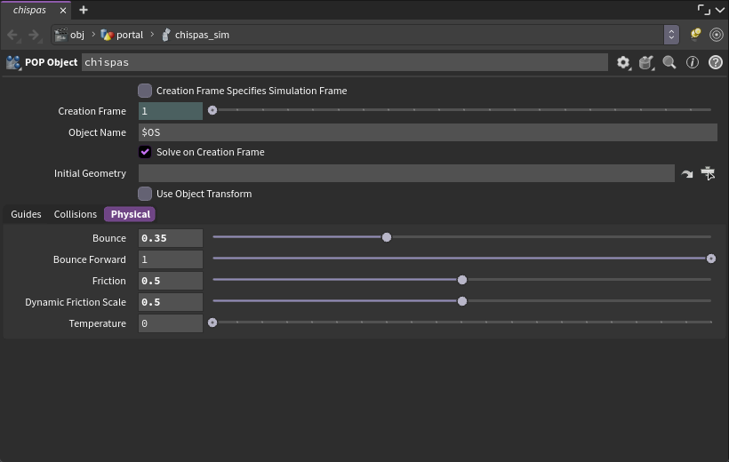
*`chispas` (POP Object), pestaña Physical: el rebote se ajusta aquí **y** en el piso, porque los dos valores se combinan.*

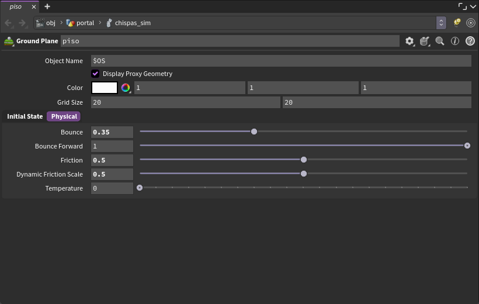
*`piso` (Ground Plane): infinito y **no se ve** en el render; el piso visible es otro objeto (paso 9).*

## Paso 7: sacar las chispas a SOPs, color y líneas
Sal del DOP Network (**U**) y, en `/obj/portal`:

1. **Tab → DOP Import**, nombre `importar_chispas`: DOP Network `../chispas_sim`, Objects `chispas`, Import Style **Fetch Geometry from DOP Network**.

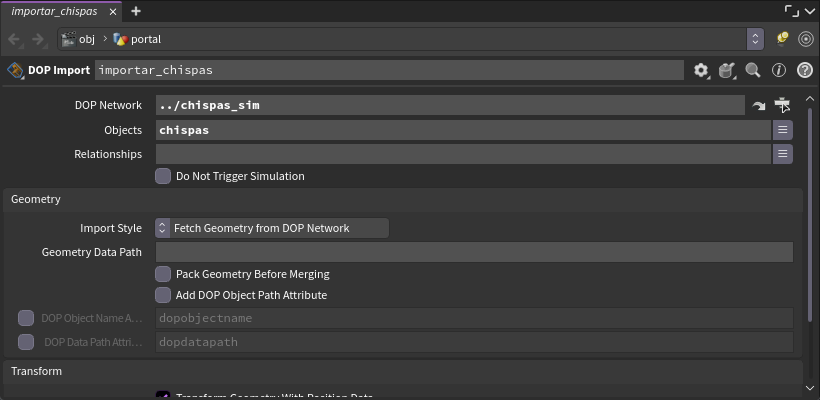

2. Debajo, **Attribute Wrangle** `color_por_edad`. El color depende de la edad de la chispa:
```vex
// Color y tamano de cada chispa segun su edad (0 = nace, 1 = muere)
float t = clamp(f@age / max(f@life, 1e-4), 0, 1);
vector amarillo = {1.0, 0.75, 0.3};
vector naranja  = {1.0, 0.3, 0.03};
vector rojo     = {0.6, 0.05, 0.0};
v@Cd = t < 0.12 ? lerp(amarillo, naranja, t / 0.12)
     : t < 0.55 ? naranja
     : lerp(naranja, rojo, (t - 0.55) / 0.45);
v@Cd *= f@brillo;   // cada chispa con su propio brillo
f@pscale = 0.012 * (1 - t);
f@Alpha = 1 - t * t;
```
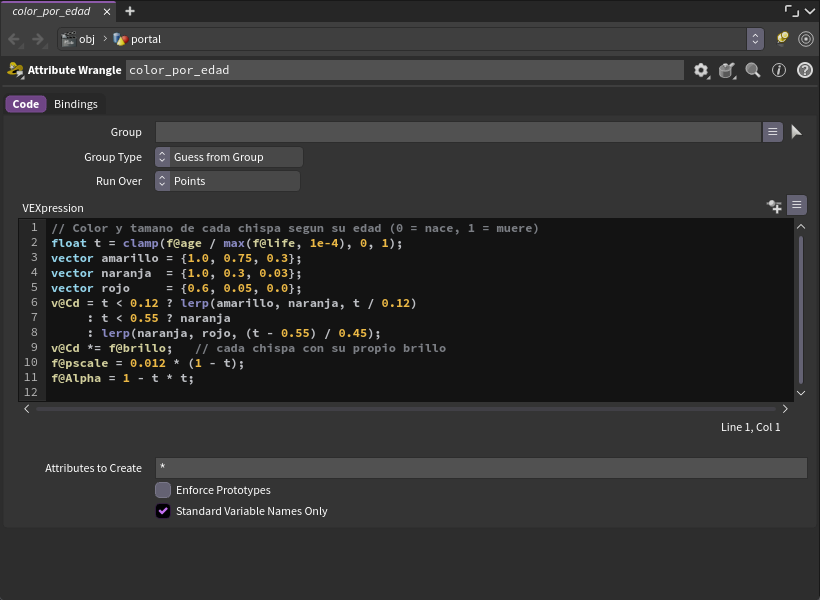

3. Debajo, **Attribute Wrangle** `estelas_lineas`. **La clave del look:** cada partícula se vuelve una línea corta hacia atrás, según su velocidad.
```vex
// Convierte cada chispa en una linea: de su posicion hacia atras, segun su velocidad.
// Asi se ve como una chispa (raya por la velocidad) y no como un punto de fuego artificial.
float largo = chf("largo_seg");                 // segundos de recorrido que muestra la estela
float vmin  = chf("largo_min");                 // largo minimo en metros
vector dir = v@v * largo;
if (length(dir) < vmin) dir = normalize(v@v + {0,1e-5,0}) * vmin;
int cola = addpoint(0, @P - dir);
setpointattrib(0, "Cd", cola, v@Cd * chf("brillo_cola"));
setpointattrib(0, "Alpha", cola, 0.0);
setpointattrib(0, "pscale", cola, f@pscale * 0.3);
addprim(0, "polyline", @ptnum, cola);
```
Sliders: **largo_seg 0.07**, **largo_min 0.12**, **brillo_cola 0.15**.

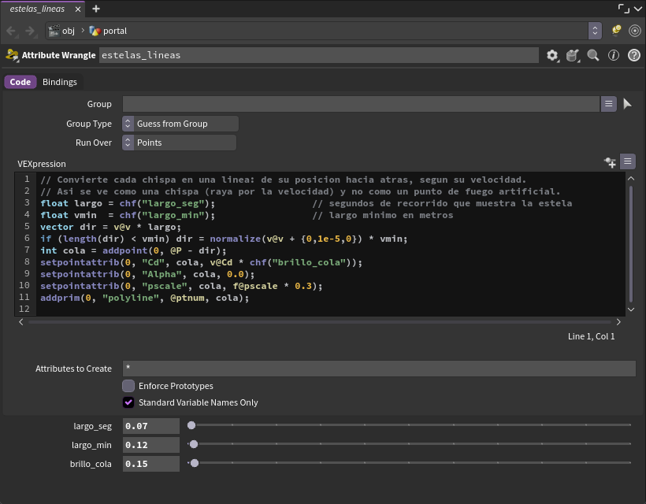

4. Debajo, **Null** `OUT_chispas` con el **display flag**.

> [!TIP]
> **Comprueba**
> Ve al frame 73. Deberías ver un anillo de ~2 m con rayas naranjas que salen girando y un centro limpio. En el *Geometry Spreadsheet* de `importar_chispas` hay ~4300 puntos. Si no pasa nada, revisa las conexiones del solver y el SOP Path de `fuente_anillo`.

## Paso 8: revisar el movimiento (OpenGL)
1. En `/obj`, **Tab → Camera**, nombre `cam_preview`: Translate (0, 0, **16**), Resolution **1280 × 720** (focal 50, por defecto). El formato final cuadrado se pone en los ROPs.

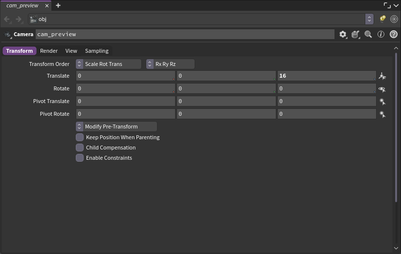

2. En `/out`, **Tab → OpenGL**, nombre `preview_opengl`: Camera `/obj/cam_preview`, Valid Frame Range **Render Frame Range** de 1 a 240, Override Camera Resolution ✔ **1024 × 1024**, Output Picture `$HIP/render/preview_opengl_1024/portal_$F3.jpg`. **Render**.

> [!NOTE]
> **Cuadrado en OpenGL vs. Karma**
> Al pasar a cuadrado, OpenGL conserva el **ancho** del encuadre y agrega alto (el portal se ve más chico, con espacio arriba). Karma conserva el **alto** y recorta los lados (el portal llena el cuadro). Para revisar movimiento no importa; el encuadre que vale es el de Karma.

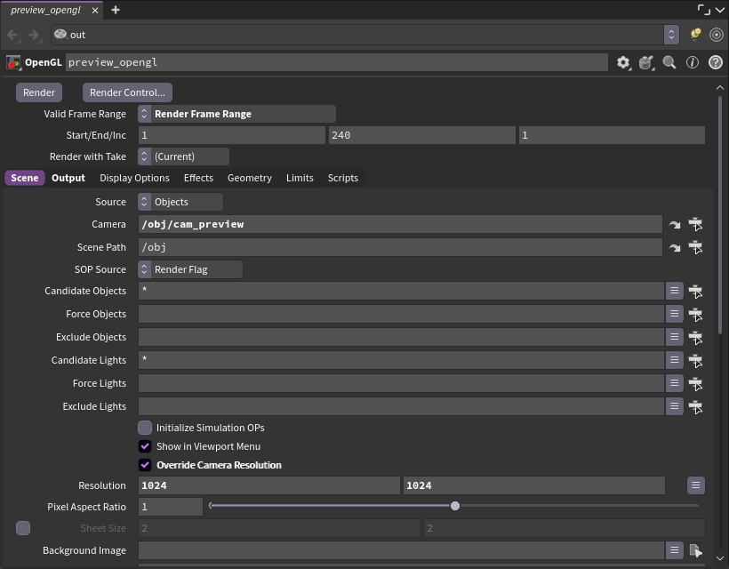

3. Arma el video y revísalo (opcional, con ffmpeg):
```bash
ffmpeg -framerate 24 -i portal_%03d.jpg -c:v libx264 -crf 18 -pix_fmt yuv420p preview.mp4
```
Tarda ~10 s para los 240 frames. **Ajusta la simulación hasta que el movimiento te guste** y solo entonces sigue con el look.

> [!TIP]
> **Reset Simulation**
> Si cambias un parámetro del POP y no ves el cambio, entra a `chispas_sim` y pulsa **Reset Simulation** (o cambia de frame al 1). Si no, se ve la caché vieja.

## Paso 9: look (anillo brillante, piso y luz)
1. **Chispas para render.** En `/obj/portal`, debajo de `estelas_lineas` (en paralelo a `OUT_chispas`), **Attribute Wrangle** `look_render`:
```vex
// Look para Karma: color HDR (emision) y grosor de las curvas
float a = f@Alpha;
v@Cd *= chf("intensidad") * a;          // la cola (Alpha 0) queda negra = se desvanece
f@width = max(f@pscale, 0.0005) * chf("grosor");
```
Sliders: **intensidad 3.5**, **grosor 0.6**. Debajo, **Null** `RENDER_chispas` con el **render flag** (morado). El display flag se queda en `OUT_chispas`.

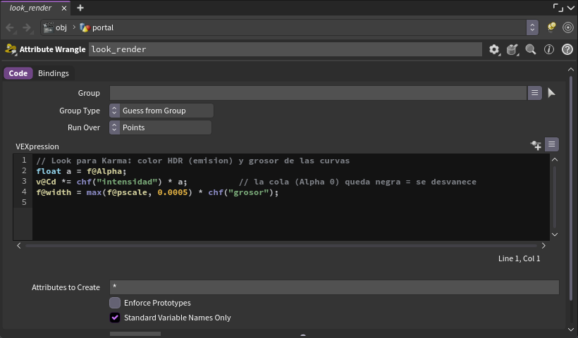

2. **Anillo brillante.** En `/obj`, **Tab → Geometry** `anillo_brillante`. Adentro:
   - **Object Merge** `traer_anillo`: Object 1 `/obj/portal/OUT_anillo`.
   - **Attribute Wrangle** `look_anillo`, con Run Over **Detail (only once)**. Rehace el borde como 6 hebras con ruido suave, para que se vea deshilachado y no como una línea limpia:
```vex
// Anillo deshilachado: varias hebras alrededor del borde, cada una con ruido propio.
// El ruido se calcula sobre el ANGULO (cos, sin) y con baja frecuencia:
// las hebras ondulan suave, sin zigzag, y el circulo cierra sin corte.
int hebras = chi("hebras");
int npts = npoints(0);
for (int h = 0; h < hebras; h++) {
    int prev = -1;
    for (int i = 0; i < npts; i++) {
        vector p = point(0, "P", i);
        vector r = normalize(set(p.x, p.y, 0));
        vector d = r * chf("ondas") + set(h * 3.1, h * 7.7, @Time * chf("velocidad"));
        float n  = noise(d);                         // ondulacion de la hebra (suave)
        float n2 = noise(d * 4 + set(0, 0, @Time * 6)); // titileo del brillo (rapido, no mueve la forma)
        vector q = p + r * (n - 0.5) * chf("deshilachado") + {0,0,1} * (n2 - 0.5) * 0.03;
        int pt = addpoint(0, q);
        float b = h == 0 ? 1.0 : fit01(rand(h * 4.3), 0.25, 0.7);   // hebra 0 = nucleo
        vector c = lerp({1.0, 0.42, 0.08}, {1.0, 0.72, 0.32}, b);
        setpointattrib(0, "Cd", pt, c * fit(n2, 0.3, 0.7, 1.5, 4) * b);
        setpointattrib(0, "width", pt, (h == 0 ? 0.014 : 0.006) * fit(n2, 0.3, 0.7, 0.7, 1.3));
        if (prev >= 0) addprim(0, "polyline", prev, pt);
        prev = pt;
    }
}
// quita el circulo original y sus puntos (solo quedan las hebras)
removeprim(0, 0, 0);
for (int i = 0; i < npts; i++) removepoint(0, i);
```
   Sliders: **hebras 6**, **deshilachado 0.12**, **ondas 3**, **velocidad 1.5**.
   - **Null** `RENDER_anillo` con display y render flag.

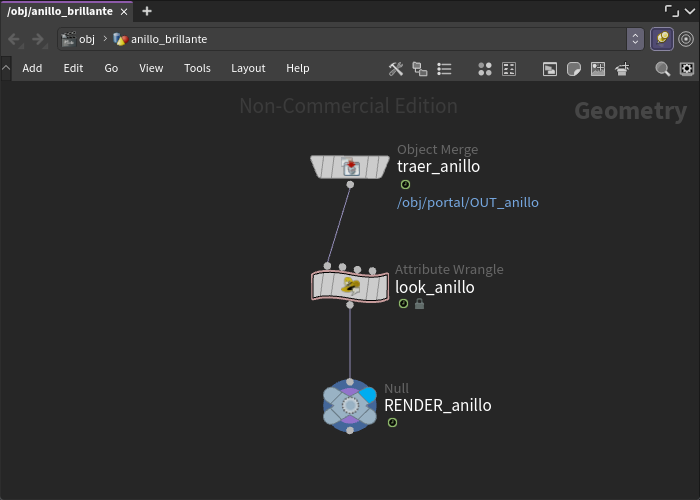
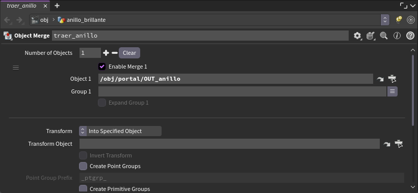
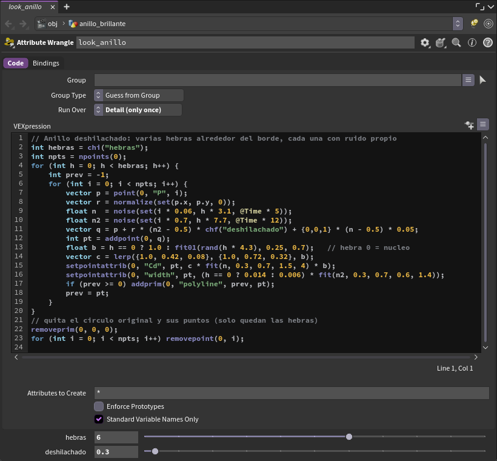

3. **Piso visible.** En `/obj`, **Tab → Geometry** `piso`; adentro, un **Grid** de **300 × 300** con Center Y **-2.6**. Déjale el **display flag encendido**: si lo apagas, Karma no lo renderiza.
4. **Luz.** En `/obj`, **Tab → Point Light**, nombre `luz_portal`: Translate (0, **-1.7**, **0.3**), Color (**1, 0.4, 0.1**), Exposure **4.5**, Intensity `(1 - pow(1 - clamp(($F - 1) / 60, 0, 1), 3))` (crece con el portal). Las chispas son tan delgadas que casi no iluminan el piso; esta luz lo simula.

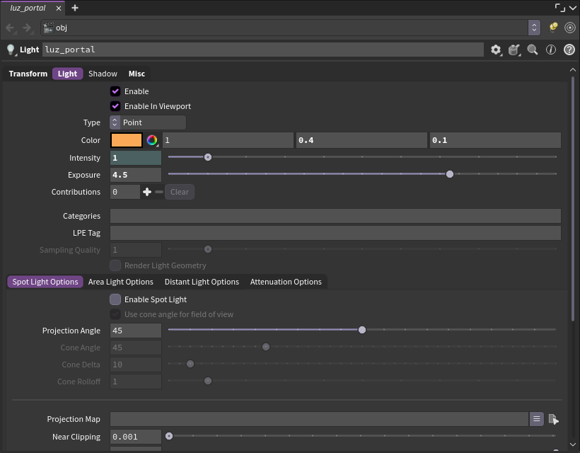

## Paso 10: materiales (MaterialX)
1. En `/mat`, **Tab → Karma Material Builder**, tres veces: `chispas_emisivo`, `anillo_emisivo` y `piso_oscuro`.
2. En `chispas_emisivo` y `anillo_emisivo`, entra y:
   - En `mtlxstandard_surface`: Base **0**, Specular **0**, Emission **1**.
   - **Tab → MtlX Geometry Property Value**, nombre `color_Cd`: Signature **Vector 3**, Geomprop **`displayColor`**. Conecta su salida a **emission_color** del `mtlxstandard_surface`.
3. En `piso_oscuro`, en `mtlxstandard_surface`: Base Color (**0.12, 0.1, 0.09**), Specular **0.5**, Specular Roughness **0.55**.
4. Asigna cada material en la pestaña **Render → Material** del objeto: `portal` → `/mat/chispas_emisivo`, `anillo_brillante` → `/mat/anillo_emisivo`, `piso` → `/mat/piso_oscuro`.

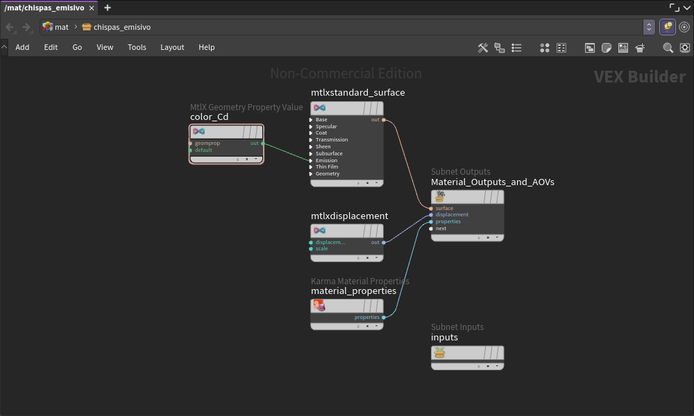
*Dentro de `chispas_emisivo`: `color_Cd` → *emission_color* del Standard Surface.*

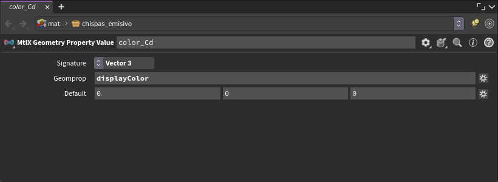

> [!IMPORTANT]
> **`displayColor`, no `Cd`**
> Al pasar a USD (Karma), el color `Cd` de SOPs se llama **`displayColor`**. Si pones `Cd` en Geomprop, las chispas salen negras.

## Paso 11: render con Karma
1. En `/out`, **Tab → Karma**, nombre `karma_look`: Camera `/obj/cam_preview`, Resolution **1024 × 1024**, Rendering Engine **XPU** (CPU si no tienes NVIDIA RTX), Path Traced Samples **256**, Output Picture `$HIP/render/karma/portal.$F4.exr`.
2. Pestaña **Rendering → Camera Effects:** desactiva **Motion Blur**. La estela ya está hecha en la geometría (paso 7); con blur quedaría doble.
3. Pestaña **Objects:** Exclude Objects `MCP_*` (solo si tienes esas cámaras de Claude).
4. Prueba **un solo frame** (Start/End **73 73**) y revisa el look. Luego pon **1 a 240** y *Render to Disk*.

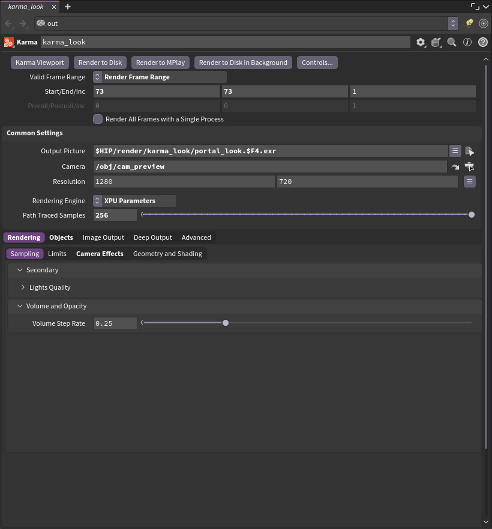
*`karma_look` configurado para el frame de prueba (73). Para el render completo, Start/End 1 y 240.*

Para renderizar sin abrir Houdini (en la Venator, con el script `render_karma.py`):
```bash
hython ../render_karma.py "experimento de houdini 5 (portal de dr strange).hipnc" --rop /out/karma_look --frames 1 240 --out render/karma_v1
```
Para ver un EXR como PNG: `hoiiotool frame.exr --ch R,G,B --colorconvert linear sRGB -o frame.png`.

> [!NOTE]
> **Cuánto tarda**
> Con una RTX 4060 (XPU) y un Ryzen 5 5600G, un frame suelto tarda ~12 s (incluye simular hasta ese frame) y la secuencia ~10.7 s por frame: **~43 min** los 240 frames. El cuello de botella es el **procesador** (simular y pasar miles de curvas a USD), no la tarjeta. Para renders repetidos conviene un **File Cache** después de `estelas_lineas`, así el render solo lee geometría. Con el humo del paso 12 sube a ~18 s por frame en promedio (de ~9 s al inicio a ~22 s al final): **~75 min**.

El **glow** de la referencia no se hace en el render: se agrega en composición (paso 13).

## Paso 12 (opcional): humo leve en el aro
Un humo 3D suave que sale del aro y brilla naranja. Es opcional: las chispas lo tapan bastante, y se nota sobre todo después de la composición, como un halo rojizo y una bruma. Por eso lleva un **interruptor** para prenderlo y apagarlo.

1. **Interruptor.** En `/obj`, **Tab → Null**, nombre `CONTROLES`. Engrane → **Edit Parameter Interface** → arrastra un **Toggle**: Name `humo`, Label `Humo en el aro`, Default encendido → *Accept*.
2. **Objeto.** En `/obj`, **Tab → Geometry**, nombre `humo`. En su parámetro **Display** (pestaña Transform, abajo) escribe la expresión `ch("../CONTROLES/humo")`. Como en `/obj` el display también es la visibilidad en Karma, apagado no aparece ni se renderiza, y no cuesta tiempo.
3. Entra a `humo` y crea:

| Nodo | Nombre | Parámetros |
|---|---|---|
| Object Merge | `traer_anillo` | Object 1 `/obj/portal/OUT_anillo` (el aro deformado, que crece con el portal) |
| Attribute Wrangle | `fuente_humo` | El código de abajo |
| Volume Rasterize Attributes | `rasterizar_fuente` | Attributes `density temperature v`, Voxel Size **0.04** |
| Pyro Solver | `sim_humo` | Voxel Size **0.04**. Shape: Dissipation **0.35**, Buoyancy Scale **0.4**, Disturbance **0.4**, Turbulence **0.3** (Swirl Size **0.5**). Sparse activado (por defecto) |
| Blast | `densidad_y_temperatura` | Group Type **Primitives**, Group `@name=flame @name=vel.*`. Quita lo que no se renderiza para que la caché pese menos. **No** borres `temperature` |
| File Cache | `cache_humo` | Base Folder `$HIP/cache`, Base Name `humo_portal`, frames **1–240**. *Save to Disk* y después activa **Load from Disk** |
| Material | `material_humo` | Material `/mat/humo_pyro` |
| Null | `OUT_humo` | Display y render flag |

```vex
// Puntos fuente del humo sobre el aro: densidad leve con ruido y un empuje hacia afuera
vector r = normalize(set(@P.x, @P.y, 0));
float n = noise(set(@P.x * 2, @P.y * 2, @Time * 0.8));
f@density = chf("densidad") * fit(n, 0.35, 0.65, 0, 1);   // manchas: no sale parejo en todo el aro
f@temperature = chf("temperatura");
v@v = r * chf("salida") + cross({0,0,1}, r) * chf("giro");
f@pscale = chf("tamano");
```
Sliders: **densidad 0.6**, **temperatura 0.4**, **salida 0.6**, **giro 1**, **tamano 0.08**.

4. **Material.** En `/mat`, **Tab → Karma Material Builder**, nombre `humo_pyro`. Adentro, borra el Standard Surface, crea un **Karma Pyro Shader** (`shader_humo`) y conecta su salida a **volume** de `Material_Outputs_and_AOVs`:
   - Smoke Color (**1, 0.6, 0.35**), Smoke Brightness **3**, Density **1**.
   - **Enable Fire** ✔: Intensity Scale **4**, Source Range de intensidad y de color **0 a 0.4**, Enable Mask ✔.

   Con el fuego activado, el humo **brilla naranja por sí mismo** y no hace falta otra luz.
5. Vuelve a renderizar con el paso 11, con `karma_look` sin cambios. El humo entra solo, porque el objeto `humo` está visible.

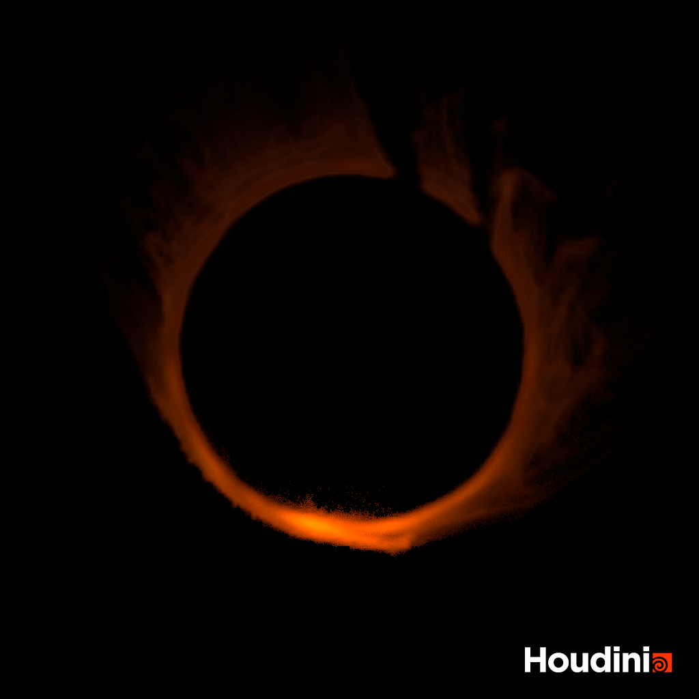
*Solo el humo (con portal, anillo y piso apagados), frame 73.*

> [!WARNING]
> **Tres cosas que no funcionan**
> 1. **El material en el objeto.** Si pones el material en *Render → Material* del objeto `humo`, Karma lo ignora en volúmenes. Tiene que ir en el **Material SOP** de adentro.
> 2. **Una luz solo para el humo.** El *Light Mask* del objeto no se respeta con el Karma de `/out`, y la luz aclara también el piso. Usa la emisión del fuego.
> 3. **Fuego sin efecto.** El fuego lee `temperature` en un rango de 0 a 1, pero aquí la temperatura llega a 0.4. Pon el **Source Range en 0–0.4**.

## Paso 13: composición en Copernicus (glow)
El glow, el tono y el color se agregan **después** del render, dentro de Houdini, con **Copernicus** (los COPs nuevos). Así se ajusta en segundos sin volver a renderizar.

1. En `/img`, **Tab → Copernicus Network**, nombre `comp_portal`. Entra y crea:

| Nodo | Nombre | Parámetros |
|---|---|---|
| File | `render_karma` | File Name `$HIP/render/karma/portal.$F4.exr` (la salida del paso 11). En la lista de AOVs: File AOV **`C`**, Channel Type **RGB** (no RGBA). Border **Constant** |
| Glow | `glow_cerca` | Glow Threshold **0.7**, Brightness **0.7**, Size **0.01**, Tint (**1, 0.7, 0.4**): halo apretado en el anillo y las chispas |
| Glow | `glow_lejos` | Glow Threshold **0.35**, Brightness **1**, Size **0.1**, Tint (**1, 0.35, 0.08**): resplandor naranja grande, también hacia el hueco |
| Tonemap | `curva_filmica` | Operator **Hable Filmic**, Exposure **1.3**: suaviza las luces altas para que el piso no se queme |
| HSV | `saturacion` | Hue Shift **−9**, Saturation Scale **1.35**: el tonemap empuja el naranja hacia dorado, y esto lo regresa |
| Output | `OUT_comp` | Conectado a `saturacion` |

2. **Guardar la secuencia.** En la misma red, **Tab → ROP Image**, nombre `guardar_comp`:
   - COP Path `/img/comp_portal/saturacion` (el nodo con la imagen, **no** el `OUT_comp`).
   - AOV Name **`hsv_adjust`**: el nombre de la **salida** de ese nodo (pasa el ratón sobre su salida para verlo).
   - Output File `$HIP/render/comp/portal_comp.$F4.png`.
   - Valid Frame Range **Render Frame Range**, **1 a 240**. *Render*.
3. Video con ffmpeg:
```bash
ffmpeg -framerate 24 -i render/comp/portal_comp.%04d.png -c:v libx264 -crf 18 -pix_fmt yuv420p portal_final.mp4
```

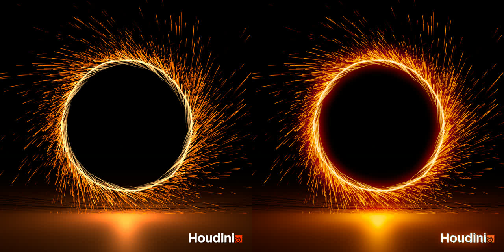
*Frame 73: el render crudo de Karma y la composición.*

Para componer sin abrir Houdini (en la Venator, con el script `comp_copernicus.py`, después de `render_karma.py`):
```bash
hython ../comp_copernicus.py "experimento de houdini 5 (portal de dr strange).hipnc" --entrada render/karma_final_humo --salida render/comp_final --nombre portal_final
```
Tarda ~35 s los 240 frames (con la RTX 4060 por OpenCL).

> [!WARNING]
> **Lo que costó**
> 1. **"No valid output AOVs specified".** El ROP Image necesita el COP Path del nodo con la imagen y, en AOV Name, el nombre de su salida (`glow`, `tonemap`, `hsv_adjust`…). El File también necesita un AOV declarado (`C`), o no tiene salidas.
> 2. **Bloques y una costura a la mitad** (arriba sin glow, abajo con glow): pasa al cargar el EXR como **RGBA**. Cárgalo como **RGB**; el fondo es negro y el alfa no hace falta.
> 3. **El piso aparece arriba de la imagen:** el Border por defecto (*Wrap*) repite la imagen al hacer el blur. Usa **Constant**.
> 4. **Lento o con aviso "Falling back to built-in CPU OpenCL driver":** Copernicus usa OpenCL. En Linux con NVIDIA instala `opencl-nvidia` (`sudo pacman -S opencl-nvidia` en Arch); `clinfo -l` debe mostrar la tarjeta.

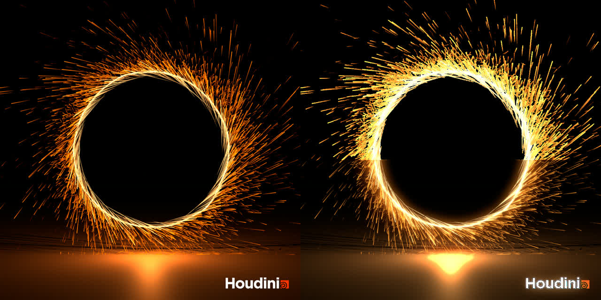
*El error de la costura (EXR cargado como RGBA).*

---

## Cómo sé que me salió bien
En el frame 73 deberías tener, más o menos:
- **~4300 chispas** vivas (`importar_chispas`) y el mismo número de líneas en `estelas_lineas`.
- El borde del anillo entre **1.9 y 2.15 m** del centro: no es un círculo perfecto y la forma cambia con el tiempo.
- El centro **limpio** y unas ~400–500 chispas sobre el piso (y = -2.6).
- En Karma: chispas **naranjas** hacia afuera (no amarillas), un anillo amarillo deshilachado y un brillo naranja suave en el piso.
- Con humo: una bruma rojiza leve alrededor del aro, que se nota más después de la composición.
- En la composición: un halo naranja alrededor del anillo y de las chispas que entra un poco al hueco, sin costuras ni bloques, y el piso sin quemarse.

## Si algo sale mal
| Síntoma | Causa probable | Solución |
|---|---|---|
| Las chispas parecen **fuegos artificiales** (puntos) | Falta `estelas_lineas` | Paso 7.3. Las chispas reales se ven como rayas |
| Las líneas parecen **pelo** pegado al anillo | Demasiado drag o chispas lentas | Air Resistance 0.3, `vel_giro` 9, `vel_salida` 3.5 |
| Las chispas de arriba se frenan y **caen** como polvo | Viven demasiado | Vida corta (0.5 ± 0.25 s, multiplicador 0.6–1.5) y más Birth Rate para compensar |
| El anillo brillante es una **línea quebrada** (zigzag) | Ruido de alta frecuencia por número de punto en `look_anillo` | Ruido por **ángulo** y de baja frecuencia, como en el código del paso 9 |
| Las chispas no se mueven al nacer | No heredan la velocidad | `fuente_anillo` → Attributes → **Use inherited velocity** |
| Chispas dentro del hueco | Fuerza `hueco` débil o metaball pequeña | Force Scale 30 y radio `radx × 0.9` |
| Atraviesan el piso | Ground plane a la derecha del merge | `piso` en la **1ª entrada** (izquierda) de `colisiones` |
| Un "chorro" enorme al inicio | La velocidad no escala con el radio | Las últimas 2 líneas de `velocidad_tangencial` |
| Las chispas salen **negras** en Karma | Geomprop `Cd` | Usa **`displayColor`** |
| Las chispas salen **amarillas** en Karma | El HDR satura el naranja | Colores más saturados e `intensidad` 3.5, no 6 |
| El **piso no sale** en Karma | Display flag del objeto `piso` apagado | Enciéndelo: en `/obj` el display flag es la visibilidad |
| Reflejo vertical muy marcado en el piso | Piso muy liso | Specular Roughness 0.55 |
| Cambio un valor y no pasa nada | Caché de la simulación | **Reset Simulation** en `chispas_sim` |
| No hay sliders / están en 0 | No se crearon los parámetros | **Create spare parameters** y escribe los valores |
| `look_anillo` sale vacío | Borré el círculo con `removeprim(0, 0, 1)` | Usa `removeprim(0, 0, 0)` y luego `removepoint` como en el código |
| El humo sale con otro color o gris | Material asignado en el objeto | Asígnalo con un **Material SOP** dentro de `humo` (paso 12) |
| El humo no brilla | Rango de fuego 0–1 o `temperature` borrada | Source Range **0–0.4** y no borres `temperature` en el Blast |
| El humo no sale en el render | Interruptor apagado o caché vacía | `CONTROLES` → *Humo en el aro* ✔ y `cache_humo` con *Load from Disk* tras guardarla |
| ROP Image: "No valid output AOVs specified" | COP Path o AOV Name mal | COP Path al nodo `saturacion` y AOV Name `hsv_adjust` |
| Glow con **bloques** o una **costura** horizontal | EXR cargado como RGBA | Channel Type **RGB** en el File |
| El piso aparece arriba en la comp | Border *Wrap* | Border **Constant** en el File |

## Para entenderlo (no es necesario para replicarlo)
- **Por qué líneas:** una chispa real se mueve muy rápido y el ojo (o la cámara) ve su recorrido. `estelas_lineas` dibuja ese recorrido como un motion blur hecho en geometría. Así se ve desde el viewport y se controla el largo.
- **Velocidad tangencial:** `cross(eje, r)` da la dirección que "barre" el borde del círculo. Sumarle algo de `r` (hacia afuera) hace que salgan en espiral.
- **Cola larga:** con `pow(rand, 3)` la mayoría de las chispas tiene valores bajos y unas pocas valores altos. Así unas pocas vuelan lejos y el borde exterior se ve irregular, no como un anillo parejo.
- **Mapa de ruido vs. fórmula:** antes de usar el mapa de ruido se probaron deformaciones por ángulo (respiración, óvalo, temblor, abolladuras), y se veían demasiado matemáticas. Un ruido 3D que se mueve por el espacio se ve más orgánico.
- **Fuerza Metaball:** RISE FX la usó en la película para que las chispas no entraran al círculo. Un objeto de colisión en el centro funciona peor y no debe verse en el render.
- **Por qué el glow en composición:** en el render cada cambio de glow costaría ~45 min; en Copernicus se ajusta mirando el resultado y se aplica a los 240 frames en segundos. Dos glows (uno chico y fuerte, otro grande y suave) se parecen más a cómo una cámara real ve una luz muy intensa que uno solo.
- **Por qué el humo brilla solo:** con una luz extra se iluminaba también el piso. La emisión del fuego del Pyro Shader solo afecta al humo.

## Variaciones para probar
- **Más caótico:** sube *Amplitude* en `mapa_de_ruido` (0.5–0.6) o baja *Pulse Duration*.
- **Más chispas lejanas:** baja `sesgo` (2) o sube `vel_max`.
- **Portal más grande:** cambia el `2 *` de la expresión del radio (todo lo demás lo sigue).
- **Sin piso:** desactiva el `piso` (DOP) y el objeto `piso`; las chispas caen al vacío.
- **Otro color (magia verde, azul):** cambia los tres colores de `color_por_edad` y los del anillo en `look_anillo`.

## Fuentes
- [RISE FX: Doctor Strange](https://www.sidefx.com/community/rise-fx-doctor-strange) (SideFX) y el [hilo del foro sobre la fuerza Metaball](https://www.sidefx.com/forum/topic/58274/).
- [Doctor Strange Inspired Portals](https://www.sidefx.com/tutorials/houdini-tutorial-2-doctor-strange-inspired-portals), Moeen Sayed (SideFX).
- [POP Source](https://www.sidefx.com/docs/houdini/nodes/dop/popsource.html), [POP Axis Force](https://www.sidefx.com/docs/houdini/nodes/dop/popaxisforce.html), [POP Metaball Force](https://www.sidefx.com/docs/houdini/nodes/dop/popmetaballforce.html), [Attribute Noise](https://www.sidefx.com/docs/houdini/nodes/sop/attribnoise.html), [Pyro Solver](https://www.sidefx.com/docs/houdini/nodes/sop/pyrosolver.html) y [Copernicus](https://www.sidefx.com/docs/houdini/copernicus/index.html) (SideFX).
- Valores tomados de la escena `experimento de houdini 5 (portal de dr strange).hipnc` (2026-10-07).

---
© 2026 Venttisca Etterna. Bajo licencia [CC BY 4.0](../LICENSE).
