# Guía: tornado de partículas en Houdini

Paso a paso para construir el tornado de la **prueba 3b** del experimento de Simulación: un embudo de partículas que gira, sube, serpentea y se deshace en la punta, sobre un piso, renderizado con Karma.

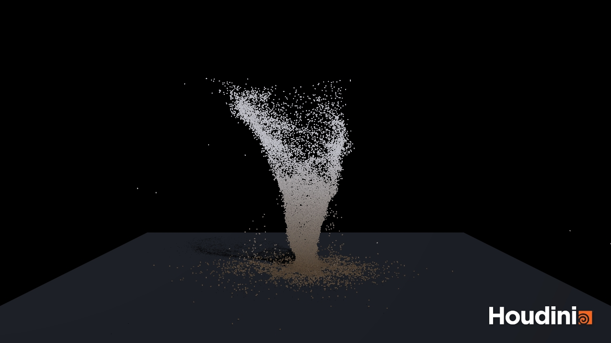
*El resultado: frame 192, render OpenGL.*

> [!TIP]
> **Versión web:** esta guía también está como página, con capturas ampliables, botones para copiar el código y casillas para marcar cada paso: <https://venttisca.github.io/Guias/tornado-houdini/>

> [!NOTE]
> **En resumen**
> 1. Un **círculo** en el piso suelta partículas.
> 2. Una **línea vertical** es el eje del tornado. Cada punto de la línea dice qué tan ancho es el embudo a esa altura.
> 3. Un **Vortex Force** hace girar y subir las partículas alrededor de esa línea.
> 4. **Ruido** y una regla de "muerte" por altura lo vuelven irregular, como un tornado de verdad.
>
> Tiempo aproximado: 45–60 min la primera vez. Simular 192 frames tarda ~30 s en una laptop.

## Antes de empezar
- **Versión:** Houdini 22.0 Apprentice. Funciona igual en Indie/FX; en versiones anteriores algunos nodos pueden llamarse `::2.0` o verse distintos.
- **Unidades:** 1 unidad = 1 metro. El eje Y apunta hacia arriba. Todo el tornado mide ~50 m.
- **Animación:** 24 fps, frames 1 a 240 (*Global Animation Options*, el reloj abajo a la derecha).
- **Cómo crear nodos:** dentro de una red, pulsa **Tab** y escribe el nombre del nodo (p. ej. `grid`). Doble clic en un nodo (o **I**) para entrar; **U** para salir.
- **Renombra cada nodo** con los nombres de la guía (doble clic en el nombre). No es obligatorio, pero algunos caminos (`SOP Path`) los usan y así es fácil seguir la guía.
- **Display flag** (la bandera azul a la derecha del nodo): indica qué nodo se ve en el viewport.

> [!TIP]
> **Los códigos VEX**
> Los tres bloques de código usan `chf("nombre")` para que los valores sean **sliders**. Después de pegar el código en un Wrangle, pulsa el botón **Create spare parameters** (el cuadrito con un `+` a la derecha del cuadro de código). Aparecen los sliders en 0; luego escribe los valores de la tabla.

## Mapa de lo que vas a construir
Dentro de `/obj/tornado_vortex` (nivel SOP):
```
piso_visual (Grid) → color_piso (Color) ──────────────────────┐
                                                              ├→ particulas_y_piso (Merge) → OUT (Null)
sim_tornado (DOP Network) ┄ importar_particulas → color_y_tamano ┘

emisor (Circle)                              ┄┄ lo lee emitir_base
eje_tornado (Line) → atributos_vortex (Wrangle) ┄┄ lo lee curva_eje
```
Dentro de `sim_tornado` (nivel DOP):
```
particulas (POP Object) ─────────────────────────────────────→ pop_solver  [entrada 1: Object]
emitir_base → ruido_turbulencia → punta_dispersa ────────────→ pop_solver  [entrada 3: Sources]

ground_plane ─┐  (izquierda)
pop_solver ───┴→ merge1 → fuerza_vortex → gravity1 → output
                              ↑ [entrada 2]
                          curva_eje (SOP Geometry)
```
Las flechas punteadas (┄) no son cables: el nodo lee la geometría por su **SOP Path**.

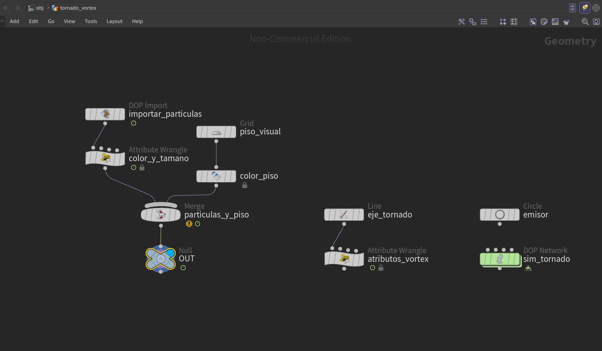
*Así se ve la red dentro de `/obj/tornado_vortex`. El display flag (azul) está en `OUT`. El aviso amarillo del merge es normal: las partículas y el piso tienen atributos distintos.*

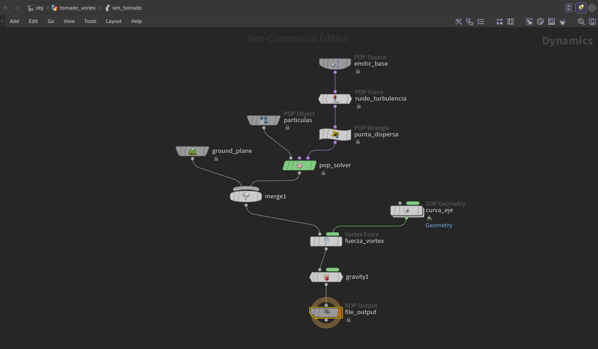
*Y así la red dentro de `sim_tornado`. Fíjate en las entradas: `punta_dispersa` llega a la 3ª entrada del solver, `ground_plane` a la izquierda del merge y `curva_eje` al costado del Vortex Force.*

---

## Paso 1: el objeto contenedor
1. En `/obj`, **Tab → Geometry**. Llámalo `tornado_vortex`.
2. Entra (doble clic). Todo lo que sigue va adentro, salvo la cámara, las luces y el render.

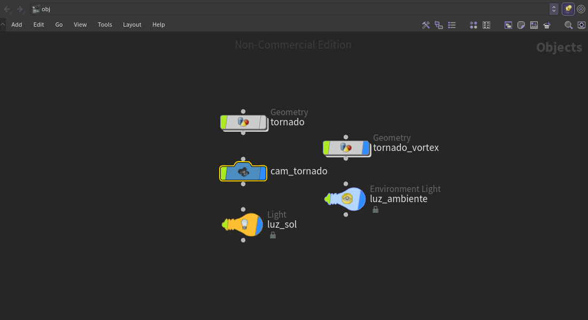
*El nivel `/obj` terminado: el objeto `tornado_vortex`, la cámara y las dos luces. (`tornado` es la prueba 1; no hace falta.)*

## Paso 2: el piso visual
El piso que **se ve**. El que **choca** con las partículas viene después (Ground Plane, en el paso 6), y ese no sale en el render.

| Nodo | Nombre | Parámetros |
|---|---|---|
| Grid | `piso_visual` | Size **120 × 120**, Rows **2**, Columns **2** |
| Color | `color_piso` | Color **(0.18, 0.2, 0.24)**. Conéctalo debajo de `piso_visual` |

## Paso 3: el emisor
Un círculo acostado en el piso; las partículas nacen sobre su superficie.

| Nodo | Nombre | Parámetros |
|---|---|---|
| Circle | `emisor` | Primitive Type **Polygon**, Orientation **ZX Plane**, Radius **4, 4**, Divisions **48** |

No se conecta a nada.

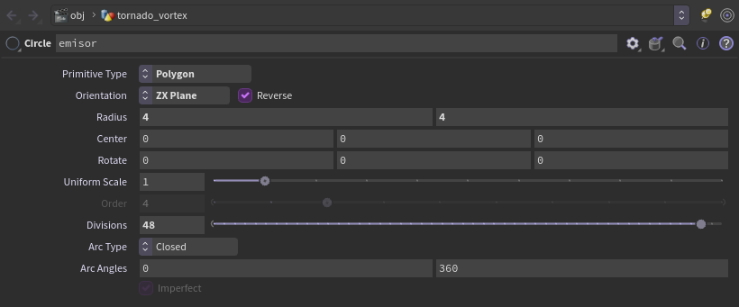
*Parámetros de `emisor`. *Reverse* se activa solo al elegir ZX Plane.*

## Paso 4: el eje del tornado (la parte clave)
Una línea vertical de 45 m. Cada punto lleva atributos que le dicen al Vortex Force **qué tan ancho** es el embudo ahí, **qué tan rápido** gira y **cuánto empuja** hacia arriba. También se mueve con ruido para que la columna serpentee.

1. **Tab → Line**, nombre `eje_tornado`: Length **45**, Points **16** (dirección 0, 1, 0, la de por defecto).

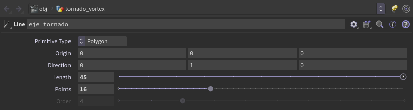
*Parámetros de `eje_tornado`.*
2. Debajo, **Tab → Attribute Wrangle**, nombre `atributos_vortex` (Run Over: *Points*). Pega:

```vex
// h: 0 en el piso, 1 arriba del tornado
float h = @P.y / 45.0;
// silueta del embudo: angosto abajo, ancho arriba
f@orbitrad  = chf("radio_base") + (chf("radio_tope") - chf("radio_base")) * pow(h, chf("curvatura"));
f@orbitvel  = chf("velocidad_orbita");   // m/s tangencial
f@orbitlift = chf("lift");               // fuerza hacia arriba (la punta la controla punta_dispersa)
f@orbitmaxd = f@orbitrad * chf("alcance"); // hasta donde llega la fuerza
// la columna serpentea: el ruido crece con la altura (la base queda fija en el piso)
vector n = noise(set(h * chf("ondas"), @Time * chf("velocidad_onda"), 0.0)) - 0.5;
vector n2 = noise(set(h * chf("ondas") + 17.3, @Time * chf("velocidad_onda"), 5.1)) - 0.5;
@P.x += n.x * 2 * chf("serpenteo") * h;
@P.z += n2.x * 2 * chf("serpenteo") * h;
```

3. Pulsa **Create spare parameters** y pon:

| Slider | Valor | Qué controla |
|---|---|---|
| radio_base | **2.5** | Radio del embudo en el piso (m) |
| radio_tope | **18** | Radio arriba (m) |
| curvatura | **1.6** | >1: el embudo se abre más cerca de la punta |
| velocidad_orbita | **18** | Velocidad de giro (m/s) |
| lift | **30** | Empuje hacia arriba |
| alcance | **1.6** | La fuerza llega hasta radio × 1.6 |
| ondas | **1.5** | Cuántas curvas tiene la columna |
| velocidad_onda | **0.4** | Qué tan rápido se mueven esas curvas |
| serpenteo | **8** | Cuánto se desplaza la punta (m) |

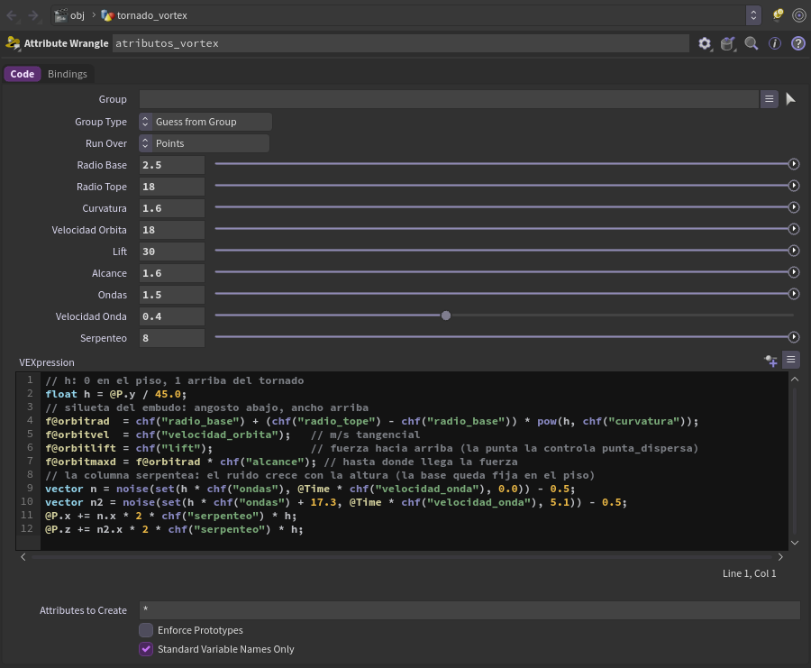
*`atributos_vortex` terminado: el código y, arriba, los sliders creados con *Create spare parameters*.*

> [!TIP]
> **Comprueba**
> Pon el display flag en `atributos_vortex` y mueve la línea de tiempo: la línea se dobla y se mueve, con la base fija en el origen. En el *Geometry Spreadsheet* aparecen `orbitrad`, `orbitvel`, `orbitlift` y `orbitmaxd`.

Los nombres de los atributos **tienen que ser exactamente esos**: son los que el Vortex Force busca por defecto.

## Paso 5: la red de simulación
**Tab → DOP Network**, nombre `sim_tornado`. Entra en él.

## Paso 6: los nodos de la simulación
Crea estos nodos dentro de `sim_tornado`:

| Nodo (Tab →) | Nombre | Parámetros |
|---|---|---|
| POP Object | `particulas` | Por defecto |
| POP Source | `emitir_base` | Emission Type **Scatter onto Surfaces**, Geometry Source *Use Parameter Values*, SOP **`/obj/tornado_vortex/emisor`**; pestaña *Birth*: Const. Birth Rate **6000**, Life Expectancy **8**, Life Variance **1.5** |
| POP Force | `ruido_turbulencia` | Force **0, 0, 0** (solo ruido). Pestaña *Noise*: Amplitude **8**, Swirl Size **6**, Pulse Length **2** |
| POP Wrangle | `punta_dispersa` | El código de abajo |
| POP Solver | `pop_solver` | Por defecto |
| Ground Plane | `ground_plane` | Por defecto (piso de colisión en y = 0) |
| Merge | `merge1` | Por defecto |
| SOP Geometry | `curva_eje` | *Use External SOP* activado, SOP Path **`/obj/tornado_vortex/atributos_vortex`**. Deja *Time* en `$T` |
| Vortex Force | `fuerza_vortex` | Lift Radius Multiplier **3**. Los nombres de atributos se quedan por defecto (`orbitrad`, `orbitvel`, …) |
| Gravity Force | `gravity1` | Por defecto (−9.81) |

Código de `punta_dispersa` (luego **Create spare parameters**):

```vex
// Cada particula tiene su propia altura de "muerte" entre altura_min y altura_max,
// asi la punta queda irregular y no se apilan en una tapa.
float limite = fit01(rand(@id * 13.7), chf("altura_min"), chf("altura_max"));
float zona   = fit(@P.y, limite - chf("zona_fade"), limite, 0, 1);
// encogen al acercarse a su limite (se desvanecen en vez de cortarse)
f@pscale = 0.04 * (1 - zona);
// cerca del limite se abren hacia afuera, como el humo que sale por arriba
vector rad = set(@P.x, 0, @P.z);
v@force += normalize(rad) * chf("empuje_afuera") * zona;
if (@P.y > limite) i@dead = 1;
```

| Slider | Valor |
|---|---|
| altura_min | **30** |
| altura_max | **50** |
| zona_fade | **8** |
| empuje_afuera | **25** |

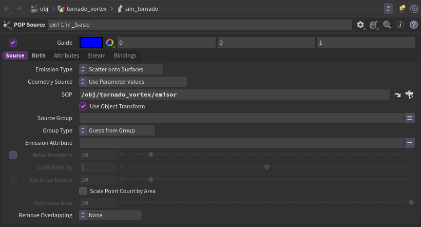
*`emitir_base`, pestaña **Source**: Scatter onto Surfaces y la ruta al `emisor`.*

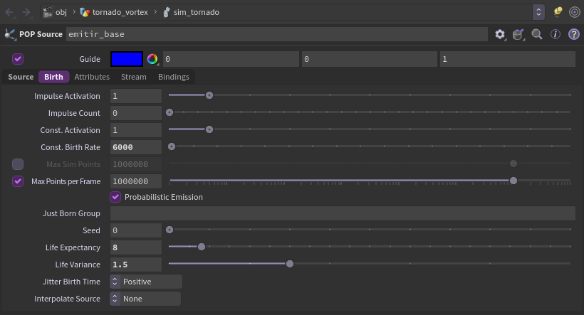
*`emitir_base`, pestaña **Birth**: 6000 partículas por segundo, vida 8 ± 1.5 s.*

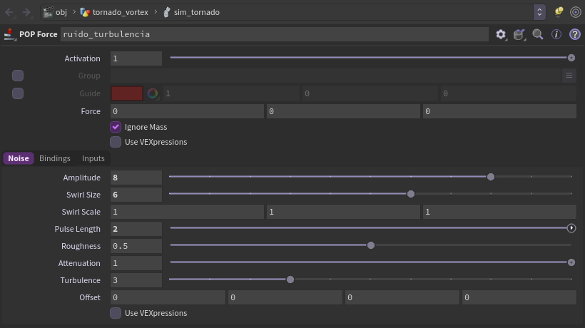
*`ruido_turbulencia`: Force en 0 y los valores en la pestaña **Noise**.*

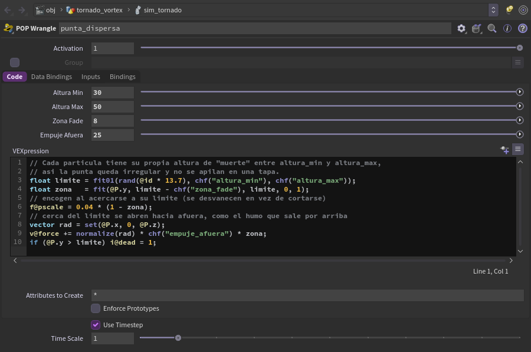
*`punta_dispersa` con su código y sliders.*

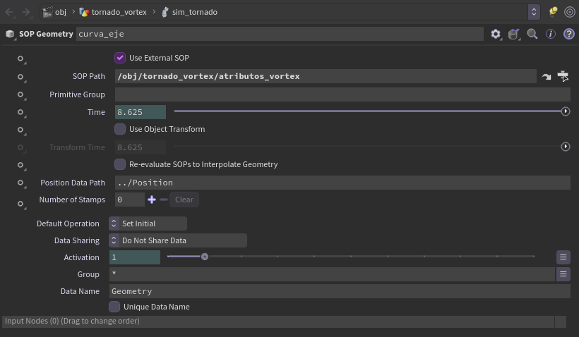
*`curva_eje`: *Use External SOP* activado y la ruta a `atributos_vortex`. El campo *Time* sale en verde porque tiene la expresión `$T` (muestra el tiempo actual, no un número fijo).*

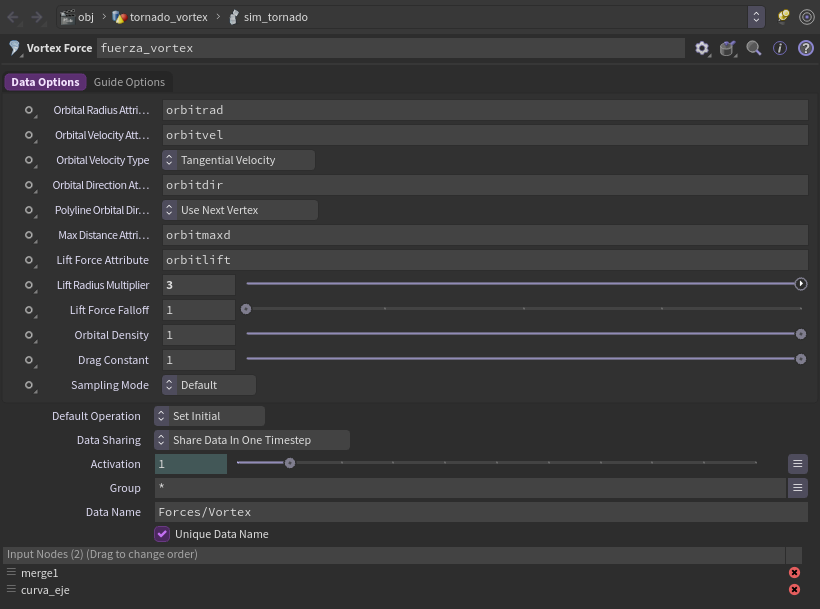
*`fuerza_vortex`: los nombres de atributo por defecto y Lift Radius Multiplier en 3. Abajo se ven sus dos entradas: `merge1` y `curva_eje`.*

## Paso 7: conectar la simulación
Aquí es donde más fácil uno se equivoca. Sigue el orden:

1. `particulas` → **1ª entrada** (Object) de `pop_solver`.
2. `emitir_base` → `ruido_turbulencia` → `punta_dispersa` → **3ª entrada** (Sources) de `pop_solver`. La 2ª entrada (Pre-Solve) queda vacía.
3. `ground_plane` → **1ª entrada (izquierda)** de `merge1`; `pop_solver` → **2ª entrada**.
4. `merge1` → **1ª entrada** de `fuerza_vortex`.
5. `curva_eje` → **2ª entrada** de `fuerza_vortex`.
6. `fuerza_vortex` → `gravity1` → `output`. El display flag va en `output`.

> [!WARNING]
> **Los dos errores típicos**
> - **El ground plane va a la izquierda del merge.** En DOPs, lo de la izquierda afecta a lo de la derecha. Si lo pones a la derecha, las partículas atraviesan el piso.
> - **El Vortex Force va después del merge**, en la cadena de objetos (como la gravedad), **no** en la cadena de POPs. No es una fuerza POP, pero el POP Solver la respeta igual.

> [!TIP]
> **Comprueba**
> Dale **Play**. Desde el frame ~20 las partículas giran y suben; hacia el frame 100 ya hay un embudo de ~45–50 m. Con el display en `fuerza_vortex` y *Show Guide Geometry* activado se ven los anillos de las órbitas.

## Paso 8: sacar las partículas a SOPs
Sal de `sim_tornado` (**U**). Crea:

| Nodo | Nombre | Parámetros |
|---|---|---|
| DOP Import | `importar_particulas` | DOP Network **`/obj/tornado_vortex/sim_tornado`**, Object Mask **`particulas`**, Import Style *Fetch Geometry from DOP Network* |
| Attribute Wrangle | `color_y_tamano` | Debajo de `importar_particulas`. Código de abajo; slider `escala_render` **3** |
| Merge | `particulas_y_piso` | Entrada 1: `color_y_tamano`; entrada 2: `color_piso` |
| Null | `OUT` | Debajo del merge. **Display flag aquí** |

```vex
// color por altura: polvo oscuro abajo, gris claro arriba
float h = fit(@P.y, 0, 30, 0, 1);
v@Cd = lerp({0.32,0.26,0.20}, {0.75,0.75,0.78}, h);
// pscale viene de la simulacion (punta_dispersa); se agranda para Karma
f@pscale *= chf("escala_render");
```

`escala_render` 3 hace las partículas más gruesas para que se vean en Karma. Para OpenGL puedes dejarlo en 1.

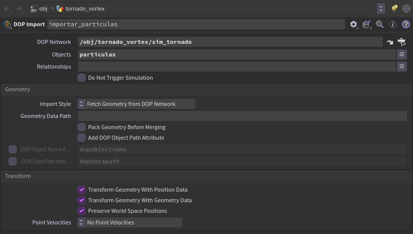
*`importar_particulas`: la red de simulación y el objeto `particulas`.*

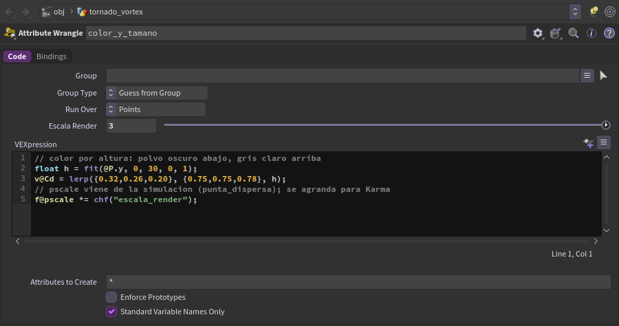
*`color_y_tamano` con el slider `escala_render`.*

## Paso 9: cámara y luces
En `/obj`:

| Nodo | Nombre | Parámetros |
|---|---|---|
| Camera | `cam_tornado` | Translate **(0, 30, 135)**, Rotate X **−2**, Focal Length **35** |
| Distant Light | `luz_sol` | Rotate **(−50, 30, 0)** |
| Environment Light | `luz_ambiente` | Intensity **0.35** (cielo azul suave) |

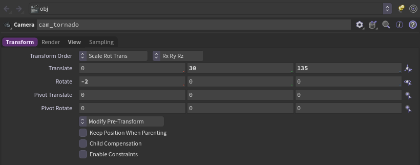
*`cam_tornado`, pestaña **Transform**.*

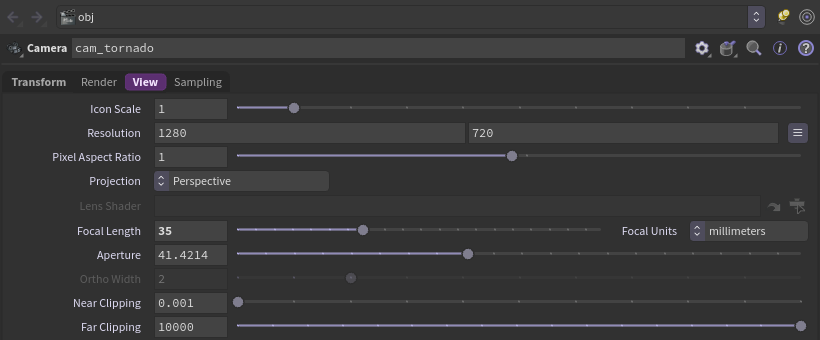
*`cam_tornado`, pestaña **View**: 1280 × 720 y lente de 35 mm.*

## Paso 10: render con Karma
1. En `/out`, **Tab → Karma**, nombre `karma_tornado`.
2. Camera **`/obj/cam_tornado`**, Resolution **1280 × 720**, Valid Frame Range *Render Frame Range*, frames **1 a 168**.
3. Output Picture: una carpeta tuya, p. ej. `$HIP/render/tornado_karma.$F4.jpg`.
4. Rendering Engine: **CPU** en laptops sin GPU NVIDIA; **XPU** si tienes una RTX (mucho más rápido).
5. **Render to Disk**.

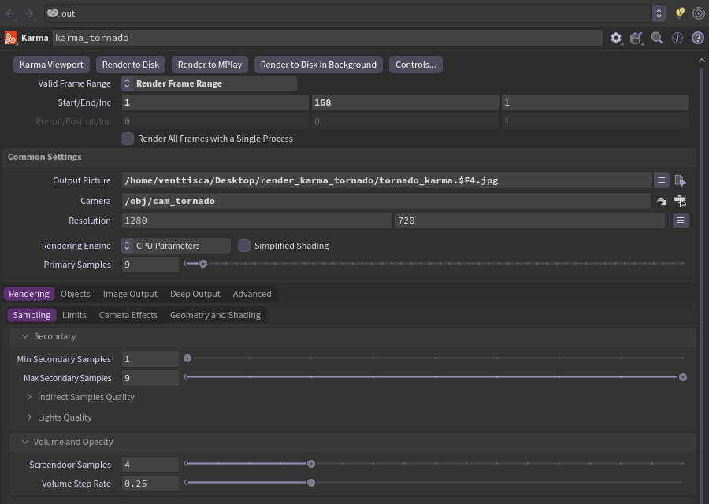
*`karma_tornado`. La ruta de *Output Picture* es la de otra computadora: cámbiala por una tuya.*
6. Para armar el video con los frames (opcional, con ffmpeg):

```bash
ffmpeg -framerate 24 -i tornado_karma.%04d.jpg -c:v libx264 -crf 23 -pix_fmt yuv420p tornado.mp4
```

> [!NOTE]
> **Cuánto tarda**
> En una laptop (CPU) cada frame tarda 6–13 s y va subiendo, porque hay más partículas. Con una RTX 4060 (XPU) baja a ~3.6 s por frame, aunque los primeros ~60 frames fueron lentos. 168 frames: ~23 min en XPU, ~32 min en CPU.

Antes de un render largo, haz una prueba rápida con **OpenGL** (ROP OpenGL, misma cámara) para revisar el encuadre.

---

## Cómo sé que me salió bien
En el frame 192 deberías tener, más o menos:
- **~34 000 partículas** vivas (Geometry Spreadsheet, nodo `importar_particulas`).
- Altura máxima **~50 m**, sin un anillo o "tapa" arriba: la cantidad baja poco a poco con la altura.
- Muchas partículas en la base (polvo) y casi ninguna a más de 30 m del centro.
- La columna se dobla y se mueve; la base se queda en su lugar.

## Si algo sale mal
| Síntoma | Causa probable | Solución |
|---|---|---|
| Giran pero **no suben** | El lift no les llega | Sube *Lift Radius Multiplier* a 3. Con 1 casi ninguna partícula recibe el empuje |
| Salen disparadas hacia el cielo | `lift` demasiado alto o falta `punta_dispersa` | `lift` 30 y revisa que `punta_dispersa` esté conectado |
| Se forma una **tapa** plana arriba | Todas mueren o se frenan a la misma altura | Revisa `altura_min`/`altura_max`: tienen que ser distintos (30 y 50) |
| Atraviesan el piso | Ground plane a la derecha del merge | Pásalo a la 1ª entrada (izquierda) |
| No pasa nada en la simulación | Fuente mal conectada o SOP Path mal escrito | `punta_dispersa` va a la **3ª** entrada del solver; revisa la ruta a `emisor` |
| La columna no se mueve | `curva_eje` no lee la curva en cada frame | Su *Time* debe ser `$T` |
| El tornado **se desarma** | Ruido muy fuerte | *Amplitude* 8. Con 15 la mitad se queda girando abajo o sale volando |
| No hay ruido / sliders en 0 | No se crearon los parámetros | Pulsa **Create spare parameters** y escribe los valores |
| Karma no muestra las partículas | `pscale` demasiado chico | Sube `escala_render` en `color_y_tamano` |

## Para entenderlo (no es necesario para replicarlo)
- **Vortex Force:** hace orbitar a las partículas alrededor de una curva. Lee de cada punto el radio (`orbitrad`), la velocidad (`orbitvel`), el empuje hacia arriba (`orbitlift`) y el alcance (`orbitmaxd`). Por eso la **forma del embudo se dibuja con una fórmula**: cambia `radio_base`, `radio_tope` o `curvatura` y cambia la silueta.
- **Por qué POP Force y no POP Wind:** POP Wind funciona como viento: lleva la velocidad de las partículas hacia la del viento, y eso frenaría el giro. POP Force solo suma una aceleración, así que agrega ruido sin estorbar.
- **Por qué cada partícula muere a una altura distinta:** si todas se detuvieran a la misma altura, ahí se juntarían en una tapa (el lift y la gravedad se igualan). `rand(@id)` le da a cada una su propio límite y la punta queda irregular.

## Variaciones para probar
- **Tornado inclinado:** cambia la dirección de `eje_tornado` (p. ej. 0.3, 1, 0).
- **Más ancho o más delgado:** `radio_base` y `radio_tope`.
- **Más violento:** sube `velocidad_orbita` y un poco `Amplitude`.
- **Más denso:** sube Birth Rate (ojo: más partículas = más lento).

## Fuentes
- [Vortex Force DOP](https://www.sidefx.com/docs/houdini/nodes/dop/vortexforce.html) (SideFX)
- [POP Force](https://www.sidefx.com/docs/houdini/nodes/dop/popforce.html) (SideFX)
- Valores tomados de la escena `experimento de houdini 2 (tornado).hipnc`, nodo `/obj/tornado_vortex` (2026-10-06).
